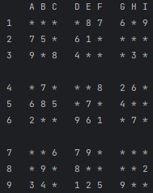
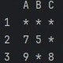
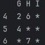
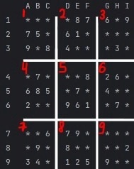

# Игра *"Судоку"*

### Вам будет предложено сыграть в "Судоку".

### Головоломка заключается в том, чтобы заполнить игровое поле цифрами в соответствии с правилами игры.

## **Правила**

- Так выглядит игровое поле:

 
 

1) Ячейка поля записывается в следующем формате:
   - **цифра** _(от 1 до 9 включительно)_ 
   - **латинская прописная буква** _(из следующего списка: A B C D E F G H I)_
   - например "2A", "5E", "8I";

2) Игра завершится, как только Вы сделаете 5 ошибок в каком-либо из блоков 3х3.

   При совершении ошибки будет указываться номер блока, в котором Вы сделали ошибку;

3) Что такое блок 3х3?
 
   В приведённом игровом поле блоком 3х3 являются, например:

 или 

4) В каком порядке нумеруются блоки 3х3?

 

5) Ошибкой считается любая введённая цифра, не предусмотренная игрой в данной ячейке.

   В каждой ячейке есть единственно верная цифра;

6) В ячейку поля вводятся цифры от 1 до 9 включительно;

7) По какому правилу распределяется расстановка цифр на поле?

   Цифры не должны повторяться в одном блоке 3х3, а также по горизонтали и вертикали;

8) В начале игры Вам будет предложен список уровней.

   Чтобы начать игру, Вам понадобится выбрать один из уровней, то есть ввести его номер;

9) Если Вы заполнили всё поле цифрами, то Вы объявляетесь победителем и игра завершается.
