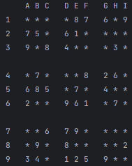
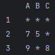
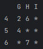

# Игра *"Судоку"*

### Вам будет предложено сыграть в "Судоку".

### Головоломка заключается в том, чтобы заполнить игровое поле цифрами в соответствии с правилами игры.

## **Правила**

- Так выглядит игровое поле:

   

1) Ячейка поля записывается в следующем формате:
   **цифра** _(от 1 до 9 включительно)_ и **латинская прописная буква** _(из следующего списка: A B C D E F G H I)_,
   например "2A", "5E", "8I";

2) Игра завершится, как только Вы сделаете 5 ошибок в каком-либо из блоков 3х3.
   При совершении ошибки будет указываться номер блока, в котором Вы сделали ошибку;

3) Что такое блок 3х3?
 
   В приведённом игровом поле блоком 3х3 являются, например:

   -   
      Или:

   -    

4) В каком порядке нумеруются блоки 3х3?
Первый блок имеет в себе ячейки от '1A' до '3C', 
Второй блок от '1D' до '3F',
